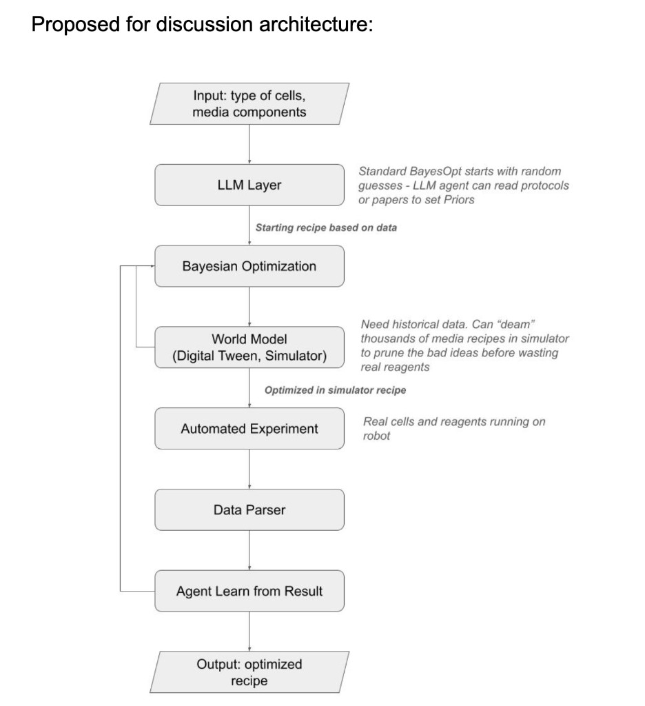

# PRD: AI-Driven Cell Culture Media Optimization Agent

**Project:** 24hr AI Science Cell Culture Hack @ Monomer Bio — Track A
**Date:** March 14-15, 2026
**Author:** Cell.ai team
**Status:** Draft

---

# 1. Description: What is it?

An autonomous AI agent that optimizes cell culture media composition in a closed loop on Monomer Bio's robotic work cell during a 24-hour hackathon. The agent uses an LLM to generate an initial media "recipe" from scientific literature for an unknown cell line (revealed morning-of), then uses Bayesian optimization to iteratively suggest new compositions. Each round, the robot mixes the media, applies it to cells in a 96-well plate, incubates, and reads outcomes via a plate reader. The results feed back into the optimization algorithm, which proposes the next set of compositions — repeating for 2-3 loops until the agent converges on the highest-yield formulation.

> **Hackathon brief:** *"Build an autonomous workflow that iteratively varies media components, runs cell culture, measures outcomes, and updates the next experiment end-to-end. All on REAL cells."*

---

# 2. Problem: What problem is this solving?

**2a. What is the problem this project addresses?**

- Cell culture scientists spend days of manual labor testing media formulations one-at-a-time — mixing, pouring, monitoring, and compiling results by hand — because no tool exists that can autonomously design, execute, measure, and iterate on media compositions in a closed loop on robotic hardware.

> *"It's more like the manual labor piece that's like the problem for all these iterative like hands-on stuff. It's not like reading results or comparing data isn't the issue — it's really like the amount of time it takes to set up so many different conditions."* — Nikki, [37:17]

**2b. What is your hypothesis for why this problem is happening?**

- Today's media optimization is a brute-force matrix exercise. A scientist testing 2 media types across 4 components manually prepares ~30 individual plates, pours media into each, monitors them over time, and compiles data into Excel. This is repeated across multiple rounds. The tools exist in pieces — Bayesian optimization libraries (BayBE, BoTorch), robotic liquid handlers (Opentrons), plate readers — but nobody has wired them into a single autonomous loop where the AI both designs and learns from each round.

> *"I might have to have like 30 different samples which are each like a plate that has my cells and my media with like the different condition, but then I also manually have to make those individual media conditions and like pour them in every plate and like monitor all those plates... it's like a matrix, like you have to make huge matrices manually in person with a bunch of different media."* — Nikki, [37:37]

**2c. What problems are you NOT solving?**

- **Contamination detection/remediation.** The team explicitly scoped this out. Contamination takes days to manifest, far beyond the 24-hour hackathon window, and would require different instrumentation.

> *"The contamination I don't think we can do much about... I don't think it's like within 24 hours and is really hard."* — Team member, [05:48]

- **Passaging / cell expansion workflows.** Passaging requires dislodging cells, which adds mechanical complexity outside the scope of this demo.

> *"Is the experiment just from seeding till confluence, or do we also have a passaging aspect? Passaging is harder because now you need to dislodge the cells."* — Nikki, [06:24]

- **Cell potency or functional characterization.** The team will focus on simple health metrics (viability, growth) rather than complex functional readouts like potency or phenotype.

> *"The health ones are probably a lot easier, right? Like if they're alive, if they're growing, it's just simpler. The other ones get a little complicated."* — Nikki, [28:06]

---

# 3. Why: How do we know this is a real problem and worth solving?

**Business Impact:**

- TetraScience's Media Formulation Assistant claims to **reduce wet lab experiments by up to 88%** — validating that AI-driven media optimization has massive efficiency gains. Synthace has **94% ARR growth** serving this same need at enterprise scale. The market demand is proven; the startup-accessible product doesn't exist yet.

- BayBE-based approaches have been published in Nature Communications (2025), achieving results using **3-30x fewer experiments** than standard DoE methods, and in cellular agriculture research achieving **181% more cells** than commercial media variants while using **38% fewer experiments**.

- The hackathon itself is evidence: Monomer Bio, Opentrons, and multiple AI partners have organized a sold-out 50-builder event specifically around this problem space, signaling industry urgency.

> **Hackathon page:** *"For the fifth hack in this series, we're hosting another cell culture hack that brings together the Bay Area's AI, science, and engineering communities. Teams will have access to the latest AI tools for building agents and are given the opportunity to ship on Monomer's robotic workcell and individual walk-up instruments."*

**Customer Impact:**

- Scientists currently spend hours to days on what is fundamentally manual labor — mixing, pouring, monitoring plates — rather than on scientific thinking. The bottleneck is not analysis, it's physical setup.

> *"A person could test like 50 conditions in like three hours, but like if this can spit it back faster and then do the iterative part — I think even like three times would be impressive because if I was in a lab it would take a lot longer than that."* — Nikki, [36:09]

- Media formulation is a multi-variable optimization problem with real trade-offs (e.g., growth vs. potency) that scientists currently navigate by intuition and literature review, not systematic experimentation.

> *"The same mechanism that stimulates them exhausts them. So if you want something to grow rapidly, it's always like a pro-con situation."* — Nikki, [26:33]

- The quality of optimization is limited by what the scientist can manually test. Garbage-in-garbage-out is the primary risk — if the initial guess is bad, all downstream conditions suffer.

> *"It's as good as the inputs. If for some reason what we thought wasn't correct or the best approach, then you have a bunch of options but none of them are good."* — Nikki, [40:43]

---

# 4. Success: How do we know if we've solved this problem?

Given the 24-hour hackathon constraint, success is defined as:

- **Complete at least 2-3 closed-loop optimization rounds** end-to-end (AI suggests composition -> robot mixes -> incubate -> plate read -> AI learns -> next round) with zero human intervention during each loop.

- **Demonstrate measurable improvement** in the target metric (likely optical density as a proxy for cell growth/viability) from round 1 to round 2-3, showing the AI agent learned from prior results.

- **Deliver a working demo** at Sunday 4:30pm showcase: the agent receives a mystery cell line, autonomously generates an initial media recipe from literature, executes iterative optimization on the robotic work cell, and presents a final "best recipe" with supporting data.

- **Stretch goal:** The AI agent converges on a formulation that **outperforms a naive/literature-only baseline** — demonstrating that closed-loop optimization adds value beyond a single LLM literature lookup.

> *"I think even like three times would be impressive because if I was in a lab it would take a lot longer than that."* — Nikki, [36:36]

---

# 5. Audience: Who are we building for?

**Primary: Hackathon judges and demo audience** — scientists, engineers, and builders at the Monomer Bio event who will evaluate whether the agent demonstrates a credible, end-to-end autonomous workflow on real cells.

**Secondary: Cell culture scientists** (the long-term Cell.ai user) — researchers who currently optimize media manually, want to test more conditions faster, and need a system that handles the tedious matrix of mix-pour-monitor-compile. As described in the meeting:

> *"I have these cells, I want to see this much growth — what cocktail would be good for that? Or how much quantity I should use of the individual components... like a recipe."* — Nikki, [31:32]

They need a system constrained by what's actually available in their lab:

> *"You basically have some something and something you don't have, so you want to limit the answer by what components you have right now."* — Team member, [32:37]

---

# 6. What: Roughly, what does this look like in the product?



The system has six components wired into an autonomous feedback loop:

**A. Input: Cell Type + Available Media Components**
- The mystery cell line is revealed morning-of. The scientist (or agent) specifies cell type and which media components are physically available on the robotic work cell.

**B. LLM Layer — Literature-Informed Priors**
- Standard Bayesian optimization starts with random guesses. Instead, an LLM agent reads scientific protocols and papers to set informed priors — generating a starting recipe grounded in published data for the given cell type.
- This dramatically reduces the number of wet-lab rounds needed by starting from a plausible region of the search space rather than random.

> *"We will put LLM who will go in literature for this cell type and will suggest something. So we need initial, we need this first one."* — Team member, [23:45]

**C. Bayesian Optimization Engine**
- Takes the LLM-generated starting recipe and generates a batch of ~8-12 variant compositions (one per row of a 96-well plate, with replicates across columns).
- After each round's results come back, the algorithm learns which compositions performed best and proposes the next batch.

> *"There is an algorithm which can optimize parameters... for example 12 different combinations. We create these combinations, we exchange media, we incubate, we measure something and put these results back in the algorithm, which now learns from our previous composition — which one worked, which did not — and now it gives us another set of assumptions."* — Team member, [24:14]

**D. World Model (Digital Twin / Simulator)**
- Before committing real reagents, the optimizer can "dream" — simulating thousands of candidate media recipes in silico to prune bad ideas before they reach the robot.
- Requires historical data or a learned model from prior rounds to be effective. In round 1 this layer is thin; by round 2-3 the agent has enough real data to build a predictive model that filters candidates.
- This is the key differentiator from a naive closed loop: the agent doesn't just try the next best guess, it pre-screens candidates computationally to maximize the value of each expensive wet-lab round.

**E. Automated Experiment via MCP**
- Only the simulator-vetted recipes reach the robot. The agent sends commands to Monomer's robotic work cell through MCP (Model Context Protocol):
  - **Create media mixture** — robot mixes the specified composition
  - **Media change** — robot applies the new media to wells
  - **Incubate** — robot moves plate to incubator for the required time (~4 hours per round)
  - **Plate read** — robot reads optical density or other signal as the outcome metric

> **Hackathon brief:** *"Robotic workcell actions are made available via MCP: Incubate, Create media mixture, Media change, Plateread."*

**F. Data Parser + Agent Learning**
- Raw plate reader output is parsed into structured results.
- The agent compares predicted outcomes (from the world model) against actual measurements, updates its internal model, and feeds everything back into the Bayesian optimizer for the next round.
- The feedback loop closes: **Input -> LLM Priors -> BayesOpt -> Simulator -> Robot -> Parse -> Learn -> BayesOpt -> ...**
- Output: the optimized recipe with the best measured outcome across all rounds.

> *"We have a feedback loop. We were like cooking and then we see a result, and the result is coming back in the way we can determine what part of the recipe was wrong."* — Team member, [35:15]

**Plate layout strategy:**
- 96-well plate: each row = a different media composition, columns = biological replicates.
- Fresh plate for each optimization round to avoid carryover effects confounding the results.

> *"If we will be reusing the same plate for a second loop, there is no actually valuable data because it can be affected by previous [conditions]. Yeah, there's no control if you put it on the same group of cells."* — Team member & Nikki, [21:23]

**Measurement approach:**
- Primary: optical density via plate reader (available, automated, quantitative).
- The specific readout depends on cell type (adherent vs. suspension) and plate reader capabilities — to be confirmed with organizers.

> *"How about optical density — is it giving any valuable information? Yeah, I mean we have a plate reader. So that makes sense."* — Team discussion, [11:32]

---

# 7. How: What is the experiment plan?

**Phase 1: Pre-hack preparation (before Mar 14)**
- Build the optimization pipeline: LLM literature agent + BayBE/BoTorch Bayesian optimizer + MCP client for robotic commands.
- Prepare a cell-type-agnostic framework: when the mystery cell line is revealed, the LLM generates the initial recipe and the optimizer adapts automatically.
- Confirm with organizers (via Jimmy): what cell type, what plate reader capabilities, what media components are available.

> *"The biggest unknown is actually what components are available, what can we change, what agents do we have to play with — and then the equipment."* — Team member, [25:28]

**Phase 2: Hack day execution (Mar 14, 10am - Mar 15, 3pm)**
- **Hour 0-1:** Cell line revealed. LLM generates initial recipe from literature. Team configures available components and concentration ranges.
- **Hour 1-2:** Algorithm generates first batch of ~8-12 compositions. Robot mixes and plates.
- **Hour 2-6:** Incubation round 1 (~4 hours based on expected doubling time). Team monitors.
- **Hour 6-7:** Plate read round 1. Results feed into optimizer. Algorithm proposes round 2 compositions.
- **Hour 7-11:** Round 2: mix, plate, incubate, read.
- **Hour 11-15:** Round 3 (if time permits): mix, plate, incubate, read.
- **Hour 15-18:** Compile results, prepare demo narrative and dashboard.

> *"The cells... they grow in four hours and we can do several loops."* — Team member, [01:04]
>
> *"Two loops, three maximum. I don't know if somebody would like to stay overnight there."* — Team member, [20:09]

**Phase 3: Demo (Mar 15, 4:30-5:30pm)**
- Present the full closed-loop story: mystery cell line -> LLM-generated initial recipe -> iterative optimization -> final best formulation, with data showing improvement across rounds.

---

# 8. When: When does it ship and what are the milestones?

| Milestone | Date | Risks | Mitigations |
|---|---|---|---|
| **Confirm cell type, plate reader specs, and available media components with organizers** | ASAP (before hack) | Organizers may not respond in time; mystery cell line may not be revealed until morning-of | Reach out to Jimmy via email/LinkedIn now. Build cell-type-agnostic framework so the system works regardless. |
| **Optimization pipeline built and tested (LLM + BayBE + MCP client)** | Mar 13 (day before hack) | MCP interface may not be documented until event; BayBE integration may have edge cases | Use mock MCP endpoints for pre-testing. Have fallback to manual MCP commands if API integration fails. |
| **Round 1 complete (first plate read results in)** | Mar 14, ~4pm | Incubation takes longer than expected; plate reader output format unknown | Plan for 4-hour incubation windows. Have parsing scripts ready for common plate reader output formats. |
| **Round 2 complete (demonstrable learning)** | Mar 14, ~10pm | Cells may not show measurable differences between compositions in one round | Choose a metric (OD) with enough sensitivity. Ensure enough replicates per condition for statistical signal. |
| **Round 3 complete (stretch goal)** | Mar 15, ~6am | Requires overnight presence; cell viability may degrade | Optional milestone. Even 2 rounds with clear learning is a strong demo. |
| **Demo-ready** | Mar 15, 3pm (submission deadline) | Dashboard not polished; narrative unclear | Reserve last 3 hours exclusively for demo prep. Prioritize the "story" over the "polish." |

> **Hackathon agenda:** *"Saturday 9:30a Check in + breakfast. 10:00a Kickoff. 12:00p Hack + build. Sunday 3p Final submission. 3:30-4:30p Walk around showcase. 4:30-5:30p Demos + Pitching."*

---

## NSM Tree

```
                        NORTH STAR
        OD improvement round 1 → final round
                           |
            _______________|___________________________
            |               |                         |
        LOOP             AI QUALITY                STORY
        RELIABILITY
                                                   
        Rounds           Best OD per              LLM round 1
        completed        round                    vs. basal
        autonomously     (improving?)             reference
                                                   
        Zero human       Variance                 Total
        interventions    convergence              compositions
        per loop         across rounds            tested in 24h
```

---

## Demo Metrics — what to show the judges

One slide, four numbers:

1. **Rounds completed autonomously** — "Our agent ran N closed loops with zero human intervention"
2. **OD improvement** — "Cell growth improved X% from round 1 to round N" *(the North Star)*
3. **LLM vs. basal** — "Our AI's starting recipe outperformed basal media by Y% before any optimization"
4. **Compositions explored** — "The system designed, executed, and learned from Z unique media recipes in 24 hours"

---

## Hackathon Targets

| Metric | Minimum | Strong | Stretch |
|---|---|---|---|
| North Star (OD improvement round 1 → final) | Any measurable gain | >20% | >50% |
| Rounds completed autonomously | 2 | 3 | 3 + overnight |
| Rounds to beat baseline | ≤3 | 2 | 1 (LLM alone wins) |
| Human interventions per loop | 0 | 0 | 0 |

---

## Open Questions

These were explicitly identified during the team meeting as blockers requiring information from the organizers:

1. **What cell type?** The experiment design (adherent vs. suspension, doubling time, known media requirements) depends entirely on this.

> *"Did you guys say you know what cell type it is?" / "I don't know what it is." / "This is probably something that we need to reach out to them about."* — Team discussion, [04:49]

2. **What media components are available?** The optimization search space is constrained by what Monomer physically has on-site.

> *"What is the biggest unknown is actually what components are available, what can we change."* — Team member, [25:40]

3. **What does the plate reader measure?** Optical density, impedance, fluorescence — the measurement capability determines what the agent optimizes for.

> *"I just don't know like what the plate reader is doing is the other problem. If you know what it can do then it's probably easy for us to come up with something simple to look at."* — Nikki, [30:23]

4. **Fresh plate per round or reuse?** Team leaning toward fresh plates to avoid carryover confounds, but this depends on cell/plate availability.

> *"If we will be reusing the same plate for a second loop, there is no actually valuable data because it can be affected by previous [conditions]."* — Team member, [21:23]

---

## Key Design Decisions from Meeting

| Decision | Resolution | Rationale |
|---|---|---|
| Contamination track | Out of scope | Takes days to manifest; can't demo in 24 hours |
| Passaging | Out of scope | Adds mechanical complexity; focus on seeding-to-growth |
| Optimization target | Cell growth / viability (not potency) | Simpler to measure; potency requires functional assays |
| Measurement method | Plate reader (optical density) | Available via MCP; quantitative; automated |
| Initial media recipe | LLM literature search | No starting media provided; AI generates first guess |
| Plate strategy | Fresh plate per round (preferred) | Avoids carryover confounding results |
| Number of loops | 2-3 in 24 hours | ~4 hour incubation per round; overnight stay optional |
